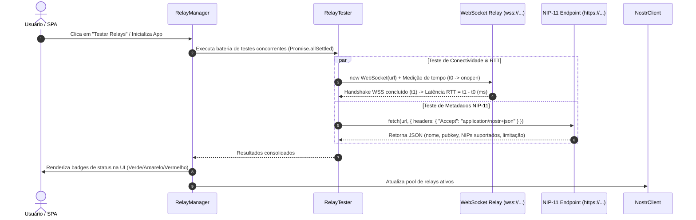

# Fase 7 — Monitoramento, Diagnóstico e Teste de Relays no Frontend

## Objetivo
Implementar na Single-Page Application (`web/`) uma camada completa de diagnóstico, medição de desempenho e gerenciamento dinâmico de relays Nostr.

## Arquitetura & Fluxo Técnico

## Sub-tarefas

- [x] **Módulo de Diagnóstico de Relays (`web/js/relay_tester.js`):**
  - Implementação da classe `RelayTester` com métodos assíncronos não-bloqueantes.
  - **Medição de Latência WSS (RTT):** Estabelecer conexão WebSocket temporária com timeout configurável (padrão: 3500ms) e calcular com precisão (`performance.now()`) o tempo de abertura do socket.
  - **Probing NIP-11:** Consulta HTTP com header `Accept: application/nostr+json` para extrair nome do relay, operador, versão do software e lista de NIPs suportados (com fallback gracioso em caso de restrições de CORS).
  - **Probing de Leitura/Subscrição:** Envio de requisição leve de subscrição (`REQ` efêmero com timeout curto) para validar se o relay aceita comandos sem desconectar.

- [x] **Gerenciador de Relays & Persistência (`web/js/relay_manager.js`):**
  - Lista de relays padrão recomendados (ex: `wss://relay.damus.io`, `wss://nos.lol`, `wss://relay.nostr.band`, `wss://nostr.mom`).
  - Suporte completo a CRUD de relays personalizados inseridos pelo usuário (adicionar, remover, editar URL).
  - Validação estrita de formato de URL (`wss://...`).
  - Ativação/Desativação seletiva (toggle) de relays individuais sem precisar deletá-los.
  - Persistência das preferências e lista customizada em `localStorage` (chave `dl_conn_relays`).
  - **Seleção Inteligente:** Algoritmo que classifica e ordena os relays por menor latência e maior taxa de sucesso.

- [x] **Interface do Usuário (UI) & Componentes Visuais (`web/index.html`, `web/style.css`, `web/app.js`):**
  - **Barra de Resumo no Header:** Exibição sintética de status com badges coloridos.
  - **Painel/Modal de Gerenciamento de Relays:**
    - Botão "Testar Todos" com animação de loading/progresso.
    - Cards individuais por relay com badges de latência coloridos (🟢 < 200ms, 🟡 200-600ms, 🟠 600-2000ms, 🔴 Offline).
    - Tooltip NIP-11 com detalhes do relay.
    - Campo de input para adicionar novo relay com validação `wss://`.
    - Botão "Restaurar Padrões".

- [x] **Integração com `NostrClient` e Ciclo de Vida:**
  - `NostrClient` consome dinamicamente o pool de relays filtrado pelo `RelayManager`.
  - Fallback automático: se conexão com relay falhar, tráfego vai para secundários.
  - Re-execução do teste de latência ao reconectar.

- [x] **Tratamento de Exceções & Edge Cases:**
  - Tratamento de bloqueios de rede/firewalls com timeout e fallback.
  - Mitigação de CORS em endpoints NIP-11 via fallback silencioso.
  - Validação de formato de URL e rate limiting implícito (testes concorrentes limitados).

- [x] **Testes Automatizados & Validação:**
  - Testes unitários de parsing e validação de URLs WSS.
  - Teste de timeout e fallback quando relays simulados estão inacessíveis.
  - Teste de ordenação por latência e persistência no storage local.
  - **40 testes passando** (`web/tests/relay_tests.js`).

## Onde isso vive no código
- `web/js/relay_tester.js` (Módulo de teste de latência e NIP-11)
- `web/js/relay_manager.js` (Módulo de gerenciamento de lista e ordenação)
- `web/js/nostr_client.js` (Integração dinâmica com o pool)
- `web/app.js` (Controlador da UI, eventos de clique e sincronização de estado)
- `web/index.html` (Marcação HTML do modal/seção de relays)
- `web/style.css` (Estilos responsivos, badges coloridos e animações)

## Critérios de Aceite
1. ✅ O usuário consegue visualizar a lista de relays com indicador de latência RTT em tempo real na SPA.
2. ✅ O botão "Testar Relays" mede a conectividade de todos os relays configurados de forma concorrente sem travar a interface.
3. ✅ Relays offline ou com falha exibem indicação visual clara de erro (vermelho com motivo da falha).
4. ✅ O usuário pode adicionar um novo relay `wss://`, testá-lo instantaneamente e persistir sua inclusão entre recarregamentos de página.
5. ✅ O `NostrClient` utiliza automaticamente os relays ativos e mais rápidos para enviar a mensagem cifrada de descoberta ao daemon NixOS.
6. ✅ A interface funciona perfeitamente em telas compactas (smartphones) e desktop, respeitando temas claro e escuro.
