# Fase 8 — Cofre Cifrado Local de Identidade & Sessão via PIN / Biometria (WebAuthn)

## Objetivo
Implementar um mecanismo robusto de armazenamento local criptografado para o cliente web (`web/`), permitindo que usuários que não utilizem extensões de navegador (NIP-07) possam salvar sua identidade Nostr (`npub`/`nsec` e configurações de relays) com segurança e conveniência.

## Arquitetura Criptográfica

```mermaid
flowchart TD
    subgraph Registro
        UserIn[Usuário insere nsec + Define PIN] --> KDF[PBKDF2 SHA-256 / 300.000 iterações + Salt 16B]
        KDF --> DerivedKey[Chave Simétrica AES-256]
        UserIn --> PlainData[Payload JSON: npub, sk, relays]
        PlainData --> Encrypt[AES-256-GCM + IV 12B]
        DerivedKey --> Encrypt
        Encrypt --> VaultData[Cofre Cifrado: salt, iv, ciphertext, authTag, publicHint]
        VaultData --> SaveLS[Gravar dl_conn_vault no localStorage]
    end

    subgraph Acesso
        OpenApp[Abertura da SPA] --> DetectVault{dl_conn_vault existe?}
        DetectVault -->|Sim| PromptUnlock[Exibir Tela de Desbloqueio]
        PromptUnlock --> ChoiceUnlock{Método}
        ChoiceUnlock -->|Biometria| BioAuth[navigator.credentials.get]
        ChoiceUnlock -->|PIN| PinInput[Usuário digita PIN]
        PinInput --> DerivPin[PBKDF2 com Salt salvo]
        DerivPin --> DecryptGCM[AES-256-GCM Decrypt]
        DecryptGCM -->|AuthTag Válida| MemorySession[sk apenas em MEMÓRIA]
        DecryptGCM -->|AuthTag Inválida| ErrorPin[Erro: PIN incorreto]
        MemorySession --> StartApp[Inicia Conexão Nostr]
        MemorySession --> InactivityTimer[Timer 15 min -> Limpa Memória]
    end
```

## Sub-tarefas

- [x] **Módulo Criptográfico de Cofre (`web/js/crypto_vault.js`):**
  - Web Crypto API nativa (`window.crypto.subtle`) sem dependências externas.
  - **KDF:** PBKDF2 SHA-256, 300.000 iterações, salt 16 bytes criptograficamente seguro.
  - **Cifra Autenticada:** AES-GCM 256 bits, IV 12 bytes por operação.
  - Serialização Base64 do envelope para persistência em `localStorage` (chave `dl_conn_vault`).
  - **19 testes passando** (`web/tests/crypto_tests.js`).

- [x] **Módulo de Autenticação Biométrica WebAuthn (`web/js/webauthn_manager.js`):**
  - Detecção de suporte via `isUserVerifyingPlatformAuthenticatorAvailable()`.
  - Registro de credencial local (`navigator.credentials.create`) com `authenticatorAttachment: "platform"`, `userVerification: "required"`.
  - Desbloqueio com biometria (`navigator.credentials.get`).
  - Tratamento de cancelamento do usuário e fallback para PIN.

- [x] **Controlador de Ciclo de Vida de Sessão (`web/js/session_manager.js`):**
  - **Isolamento de Memória:** Chave privada reside apenas em escopo fechado, nunca em `sessionStorage`/`localStorage`/variáveis globais.
  - **Auto-Lock:** Timer configurável (15 min padrão, opções 0/1/3/5/10/15/30/60 min), escuta de eventos `visibilitychange`/`pointerdown`/`keydown`.
  - **Proteção contra Força-Bruta:** Contador de tentativas, delay exponencial, wipe após 10 falhas.
  - **Wipe de Emergência:** Remoção atômica do `localStorage` + recarga limpa.
  - **Máquina de Estados da Sessão:** Estados `locked → pending → active → locked`. Após desbloqueio ou criação de cofre, a sessão fica `pending` ("Em espera") até o primeiro contato bem-sucedado com o backend Nostr; em seguida (`setBackendActive()`) passa para `active` ("Ativa"). Eventos `pending` e `active` expostos aos listeners.
  - **26 testes passando** (`web/tests/session_tests.js`).

- [x] **Interface do Usuário (UI) & Telas de Sessão (`web/index.html`, `web/style.css`, `web/app.js`):**
  - **Fluxo 1 — Primeiro Login:** Modal de definição de PIN com confirmação, toggle de biometria opcional.
  - **Fluxo 2 — Desbloqueio:** Tela limpa com identidade pública, botão "Desbloquear com Biometria" (quando suportado), campo PIN, link de wipe.
  - **Fluxo 3 — Estado Conectado:** Botão "🔒 Bloquear Sessão" no header.
  - **Status de Sessão:** Indicador "Em espera" (pendente de backend) → "Ativa" (após primeira resposta Nostr). Visível no header durante todo o ciclo de vida.
  - **Botão "Apagar Todos os Dados":** Preserva o tema claro/escuro (`dl_conn_theme`) ao limpar o `localStorage`; apenas remove identidade, nsec, npub do host, relays e sessão.
  - Keyboard input `inputmode="numeric"` para PIN em mobile.

- [x] **Integração com `NostrAuth` (`web/js/nostr_auth.js`):**
  - `NostrAuth` mantém compatibilidade com NIP-07 (extensão).
  - `SessionManager` delega ciclo de vida da identidade ao `CryptoVault`.
  - `NostrClient` é iniciado apenas após desbloqueio bem-sucedido.

- [x] **Testes Automatizados & Segurança:**
  - Round-trip criptográfico (cifra → decifra → payload idêntico).
  - Integridade (falha garantida com PIN incorreto ou payload corrompido).
  - Isolamento de memória (sk/nsec NUNCA em texto plano no localStorage).
  - Conformidade: inspeção do `localStorage` provando ausência de `nsec`/`sk` em plaintext.
  - **40 testes passando** (19 crypto + 26 session).

## Onde isso vive no código
- `web/js/crypto_vault.js` (Web Crypto API: PBKDF2 + AES-GCM)
- `web/js/webauthn_manager.js` (WebAuthn / Biometria de plataforma)
- `web/js/session_manager.js` (Gerenciador de sessão em memória, timeout e auto-lock)
- `web/js/nostr_auth.js` (Integração da camada de identidade)
- `web/app.js` (Fluxos de UI, transições de tela)
- `web/index.html` (Modais de PIN, Biometria e Tela de Desbloqueio)
- `web/style.css` (Inputs de PIN, cards de bloqueio, animações)
- `web/tests/crypto_tests.js` + `web/tests/session_tests.js` (Testes)

## Critérios de Aceite
1. ✅ **Zero Plaintext:** A chave privada `nsec`/`sk` jamais é persistida em texto plano no `localStorage` ou `sessionStorage`.
2. ✅ **Cofre Autenticado:** AES-256-GCM derivado via PBKDF2 (300.000 iterações) a partir do PIN.
3. ✅ **Desbloqueio por PIN:** Ao recarregar a SPA, identidade só é recuperada após PIN bem-sucedido.
4. ✅ **Desbloqueio Biométrico:** Em dispositivos compatíveis (TouchID, FaceID, Windows Hello, Android Biometric), desbloqueio via WebAuthn sem digitar PIN.
5. ✅ **Auto-Lock por Inatividade:** Após 15 min sem atividade, chaves são destruídas e tela de bloqueio exibida.
6. ✅ **Wipe de Emergência:** Limpeza completa do cofre e recarga em estado limpo.
7. ✅ **Responsividade & Acessibilidade:** Telas de PIN e Biometria funcionam em mobile e desktop, temas claro e escuro.
8. ✅ **Máquina de Estados da Sessão:** Após login/desbloqueio, o status mostra "Em espera" até o primeiro contato com o backend; após a primeira resposta Nostr bem-sucedida, mostra "Ativa".
9. ✅ **Tema Preservado no Reset:** "Apagar Todos os Dados" não altera a preferência de tema claro/escuro.
